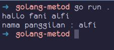
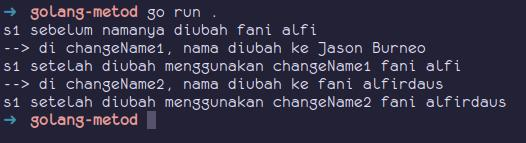

# Method

method adalah sebuah function yang menempel pada `type` (bisa `struct` atau yang lain), dan method pada `struct` bisa dipanggil lewat variabel `struct`.

keunggulan method dibanding function biasa adalah memiliki akses ke properti struct hingga level _private_ (level akses akan dibahas lain kali), dan juga dengan menggunakan method sebuah proses bisa di-enkapsulasi dengan baik.

<details>
  <summary>contoh pembuatan / penerapan method</summary>

cara penerapan atau pembuatan method sedikit berbedan dengan cara pembuatan function, dimana ketika dideklarasikan, ditentukan juga siapa pemilik method / receiver method tersebut.

```go
package main

import (
  "fmt"
  "strings"
)

type Student struct {
  name string
  grade int
}

func (s Student) sayHello() {
  fmt.Println("hallo", s.name)
}

func (s Student) getNameAt(position int) string {
  return strings.Split(s.name, " ")[position - 1]
}
```
</details><br>

cara mendeklarasikan method sama seperti function, hanya saja perlu ditambahkan deklarasi variabel struct  di sela sela keyword `func` dan nama function.
Struct yang digunakan akan menjadi pemilik method.

`func (s Student) sayHello()`, function `sayHello()` dideklarasikan sebagai method milik struct `Student`.
Pada contoh di atas function `sayHello()` dan `getNameAt()` menjadi miliknya struct `Student`.

<details>
  <summary>Contoh pemanfaatannya bisa dilihat pada code berikut</summary>

```go
func main() {
  var s1 = Student{"fani alfi", 17}
  s1.sayHello()

  var name = s1.getNameAt(2)
  fmt.Println("nama panggilan", name)
}
```
hasilnya akan tampah seperti berikut :
 

cara mengakses method sama seperti saat mengakses field pada struct
</details><br>

method memiliki sifat sama seperti function biasa, seperti bisa memiliki parameter, memiliki return value, dll

## method pointer

method pointer adalah sebuah method yang variabel struct nya berupa pointer.
Kelebihan method ini adalah ketika melakukan manipulasi pada nilai field pada sebuah struct-nya maka nilai pada field tersebut akan dirubah pada referensinya.

<details>
  <summary>contoh method pointer</summary>

```go
type Student struct {
  nama string
  umur int
}

func (s Student) changeName1(name string) {
  fmt.Println("--> di changeName1, nama diubah ke", name)
  s.nama = nama
}

func (s *Student) changeName2(name string) {
  fmt.Println("--> di changeName2, nama diubah ke", name)
  s.nama = name
}

func main() {
  var s1 = Student{"fani alfi", 17}
  fmt.Println("s1 sebelum namanya diubah", s1.nama)

  s1.changeName1("Jason Burneo")
  fmt.Println("s1 setelah diubah menggunakan changeName1", s1.nama)
  // fani alfi

  s1.changeName2("fani alfirdaus")
  fmt.Println("s1 setelah diubah menggunakan changeName2", s1.nama)
  // fani alfirdaus
}
```
saat program di atas dijalankan outputnya akan seperti berikut ini


</details><br>

pada contoh diatas setelah method `changeName1()` dijalankan, nilai `s1.nama` tidak berubah.
Sebenarnya saat method `changeName1()` dijalankan value dari field `s1.nama` sudah berubah, tetapi hanya berubah di method `changeName1()` saja, value pada referensi tidak berubah.

keistimewahan lain dari method pointer adalah method itu sendiri bisa dipanggil dari variabel struct biasa maupun variabel struct pointer.

### penggunaan function `strings.Split()`

pada beberapa contoh di atas terdapat function `strings.Split()`, function ini digunakan untuk memisahkan string menggunakan pemisah yang telah ditentukan sendiri, hasil dari function tersebut adalah sebuah slice yang berisi kumpulan substring.

```go
strings.Split("fani alfi", " ")
// ["fani", "alfi"]
```
